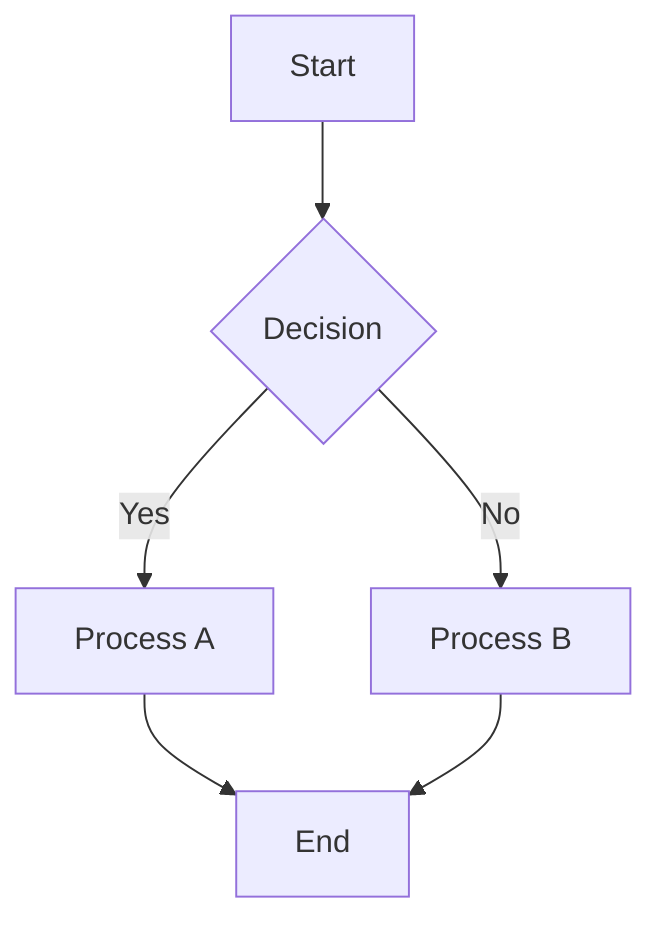

# Visualisation Libraries Reference

Comparison of graph visualisation libraries beyond React Flow.

## Library Comparison

| Library | Framework | Rendering | Best For | Learning Curve |
|---------|-----------|-----------|----------|----------------|
| React Flow | React | SVG/HTML | Interactive diagrams, flowcharts | Medium |
| D3.js | Vanilla | SVG | Custom visualisations, full control | High |
| Cytoscape.js | Vanilla | Canvas | Analysis, large graphs | Medium |
| Vis.js | Vanilla | Canvas | Quick prototypes, networks | Low |
| GoJS | Vanilla/React | Canvas/SVG | Enterprise, complex diagrams | Medium |
| Sigma.js | Vanilla/React | WebGL | Very large networks | Medium |
| G6 | Vanilla/React | Canvas | Feature-rich, Chinese ecosystem | Medium |
| Mermaid | Vanilla | SVG | Documentation, declarative | Low |

## React Flow

**Strengths:**
- React-native, hooks-based API
- Excellent customisation via custom nodes/edges
- Active development, good docs
- Built-in minimap, controls, background

**Weaknesses:**
- No built-in layout (must integrate Dagre/ELK)
- Performance degrades >1000 nodes
- SVG rendering limits scale

**Best for:** React apps needing interactive, editable diagrams

```typescript
import ReactFlow, {
  useNodesState,
  useEdgesState,
  Background,
  Controls,
  MiniMap,
} from 'reactflow';
import 'reactflow/dist/style.css';

function Flow() {
  const [nodes, setNodes, onNodesChange] = useNodesState(initialNodes);
  const [edges, setEdges, onEdgesChange] = useEdgesState(initialEdges);

  return (
    <ReactFlow
      nodes={nodes}
      edges={edges}
      onNodesChange={onNodesChange}
      onEdgesChange={onEdgesChange}
      fitView
    >
      <Background />
      <Controls />
      <MiniMap />
    </ReactFlow>
  );
}
```

## D3.js

**Strengths:**
- Maximum flexibility and control
- Excellent for custom visualisations
- Rich ecosystem (d3-force, d3-hierarchy, d3-sankey)
- Industry standard, well-documented

**Weaknesses:**
- Steep learning curve
- Not React-native (requires careful integration)
- More code for basic functionality

**Best for:** Custom visualisations, when existing libraries don't fit

```typescript
import * as d3 from 'd3';

// Force simulation example
const simulation = d3.forceSimulation(nodes)
  .force('link', d3.forceLink(links).id(d => d.id))
  .force('charge', d3.forceManyBody())
  .force('center', d3.forceCenter(width / 2, height / 2));

// React integration pattern
function D3Graph({ nodes, links }) {
  const svgRef = useRef();

  useEffect(() => {
    const svg = d3.select(svgRef.current);
    // D3 bindingshere
  }, [nodes, links]);

  return <svg ref={svgRef} />;
}
```

## Cytoscape.js

**Strengths:**
- Built-in layout algorithms
- Graph analysis features (shortest path, centrality)
- Good performance with canvas rendering
- Extensive extension ecosystem

**Weaknesses:**
- Styling syntax different from CSS
- Less intuitive for simple use cases
- React integration requires wrapper

**Best for:** Graph analysis, when you need algorithms beyond layout

```typescript
import cytoscape from 'cytoscape';
import dagre from 'cytoscape-dagre';

cytoscape.use(dagre);

const cy = cytoscape({
  container: document.getElementById('cy'),
  elements: {
    nodes: [
      { data: { id: 'a' } },
      { data: { id: 'b' } },
    ],
    edges: [
      { data: { source: 'a', target: 'b' } },
    ],
  },
  layout: {
    name: 'dagre',
    rankDir: 'TB',
  },
  style: [
    {
      selector: 'node',
      style: {
        'background-color': '#666',
        'label': 'data(id)',
      },
    },
  ],
});

// Analysis features
const shortestPath = cy.elements().aStar({
  root: '#a',
  goal: '#b',
});
```

## Vis.js (vis-network)

**Strengths:**
- Quick to set up
- Built-in physics simulation
- Decent defaults
- Good for prototypes

**Weaknesses:**
- Less flexible than alternatives
- Limited customisation
- Development pace has slowed

**Best for:** Quick prototypes, simple network visualisations

```typescript
import { Network } from 'vis-network';

const nodes = [
  { id: 1, label: 'Node 1' },
  { id: 2, label: 'Node 2' },
];

const edges = [
  { from: 1, to: 2 },
];

const network = new Network(
  container,
  { nodes, edges },
  {
    layout: {
      hierarchical: {
        direction: 'UD',
        sortMethod: 'directed',
      },
    },
    physics: {
      enabled: false,
    },
  }
);
```

## GoJS

**Strengths:**
- Enterprise-grade features
- Excellent documentation
- Built-in templates for common diagrams
- Good performance

**Weaknesses:**
- Commercial license required for production
- Opinionated API
- Heavy library size

**Best for:** Enterprise applications, complex business diagrams

```typescript
import * as go from 'gojs';

const diagram = new go.Diagram('myDiagramDiv', {
  'undoManager.isEnabled': true,
  layout: new go.TreeLayout({ angle: 90 }),
});

diagram.nodeTemplate = new go.Node('Auto')
  .add(new go.Shape('RoundedRectangle', { fill: 'white' }))
  .add(new go.TextBlock({ margin: 8 }).bind('text', 'name'));

diagram.model = new go.GraphLinksModel(
  [{ key: 1, name: 'Alpha' }, { key: 2, name: 'Beta' }],
  [{ from: 1, to: 2 }]
);
```

## Sigma.js

**Strengths:**
- WebGL rendering for massive graphs
- Handles 10,000+ nodes smoothly
- Good for network exploration

**Weaknesses:**
- Less flexible node customisation
- Focused on network graphs specifically
- Steeper learning curve for customisation

**Best for:** Large-scale network visualisation, social graphs

```typescript
import Graph from 'graphology';
import Sigma from 'sigma';

const graph = new Graph();
graph.addNode('a', { x: 0, y: 0, size: 10, label: 'Node A' });
graph.addNode('b', { x: 1, y: 1, size: 10, label: 'Node B' });
graph.addEdge('a', 'b');

const renderer = new Sigma(graph, container);
```

## G6 (AntV)

**Strengths:**
- Feature-rich
- Built-in layouts (force, dagre, radial, etc.)
- Good animations
- Active development (Ant Design team)

**Weaknesses:**
- Documentation primarily in Chinese
- Large bundle size
- Less common in Western codebases

**Best for:** Feature-rich applications, when bundle size isn't critical

```typescript
import G6 from '@antv/g6';

const graph = new G6.Graph({
  container: 'mountNode',
  width: 800,
  height: 600,
  layout: {
    type: 'dagre',
    rankdir: 'LR',
  },
  defaultNode: {
    type: 'rect',
    size: [100, 40],
  },
});

graph.data(data);
graph.render();
```

## Mermaid

**Strengths:**
- Declarative text syntax
- Zero code for basic diagrams
- Great for documentation
- GitHub/GitLab native support

**Weaknesses:**
- Limited interactivity
- Less control over layout
- Not suitable for dynamic data

**Best for:** Documentation, static diagrams, quick sketches

```markdown

```

## Decision Matrix

**Choose based on primary need:**

| Need | Recommendation |
|------|---------------|
| React app, editable diagrams | React Flow |
| Full customisation, any visualisation | D3.js |
| Graph analysis features | Cytoscape.js |
| Quick prototype | Vis.js |
| Enterprise, complex business rules | GoJS |
| 10,000+ nodes | Sigma.js |
| Documentation, static | Mermaid |

**Combining libraries:**

- React Flow + ELK: Best layout with React ergonomics
- D3.js + React: Custom visuals with React state management
- Cytoscape.js + React wrapper: Analysis features with React

## Migration Considerations

### From Vis.js to React Flow

```typescript
// Vis.js format
{ id: 1, label: 'Node' }
{ from: 1, to: 2 }

// React Flow format
{ id: '1', data: { label: 'Node' }, position: { x: 0, y: 0 } }
{ id: 'e1-2', source: '1', target: '2' }
```

### From Cytoscape to React Flow

```typescript
// Cytoscape format
{ data: { id: 'a', label: 'Node A' } }
{ data: { source: 'a', target: 'b' } }

// React Flow format
{ id: 'a', data: { label: 'Node A' }, position: { x: 0, y: 0 } }
{ id: 'a-b', source: 'a', target: 'b' }
```

Key differences:
- React Flow requires explicit positions (use layout engine)
- React Flow uses string IDs consistently
- React Flow separates `data` from other node properties
